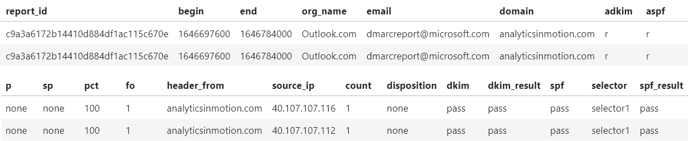

<div align="center">

</div>

<h1 align="center">DMARCParser.jl</h1>

<!-- badges: start -->
<div align="center">


[](https://julialang.org/)&nbsp;&nbsp;
[](https://github.com/analyticsinmotion/DMARC.jl/blob/main/LICENSE)&nbsp;&nbsp;
&nbsp;&nbsp;
[](https://analyticsinmotion.github.io/DMARCParser.jl/stable/)&nbsp;&nbsp;
[](https://analyticsinmotion.github.io/DMARCParser.jl/dev/)&nbsp;&nbsp;
[](https://github.com/analyticsinmotion/DMARCParser.jl/actions/workflows/CI.yml)&nbsp;&nbsp;
[](https://www.analyticsinmotion.com)&nbsp;&nbsp;
<!-- [](https://codecov.io/gh/analyticsinmotion/DMARCParser.jl)&nbsp;&nbsp; -->

</div>
<!-- badges: end -->

## What is DMARCParser.jl?
`DMARCParser.jl` is a specialized Julia package designed to processes DMARC aggregate reports, typically in XML format, transforming them into a more human-readable and interpretable format. This transformation allows users to efficiently analyze and gain valuable insights into their domain's email activity, ultimately helping them take proactive steps to ensure email security and prevent malicious activities.

<br />

## Functions available in DMARCParser.jl
The following table provides an overview of the functions that can be used in DMARCParser.jl.

| Function  | Description |
| ------------- | ------------- | 
| dmarc(filename)  | Parses the DMARC Aggregate Report XML file and returns the key fields and their raw data values in a *DataFrame*. |
| dmarc_formatted(filename)  | Parses the DMARC Aggregate Report XML file and returns a *DataFrame* of the key fields with some formatting of values. E.g., Date fields |
| get_dmarc_data(filename)  | Parses the DMARC Aggregate Report XML file and returns the key fields and their raw data values in a *Dictionary*. |

<br />

## How to use DMARCParser.jl

### Installation
You can install the latest **DMARCParser.jl** release with Julia's package manager:

```julia-repl
]
add DMARCParser
```

or

```julia
using Pkg
Pkg.add("DMARCParser")
```

### Usage
DMARCParser.jl can be executed with just three lines of code.
```julia
using DMARCParser
xml_file_name_and_path = "data\dmarc_aggregate_report.xml"
dmarc_report = dmarc(xml_file_name_and_path)
```
This will return a DataFrame similar to the one below:
<br />



<br />

To add some formatting like converting *begin* and *end* to DateTime format, use the dmarc_formatted function:
```julia
using DMARCParser
xml_file_name_and_path = "data\dmarc_aggregate_report.xml"
dmarc_report = dmarc_formatted(xml_file_name_and_path)
```

<br />

Should you just want the raw data, use the get_dmarc_data function:
```julia
using DMARCParser
xml_file_name_and_path = "data\dmarc_aggregate_report.xml"
dmarc_raw = get_dmarc_data(xml_file_name_and_path)
```
This will return a dictionary with key => pairs for the variables and their values

<br />

## DMARC Data Definitions

DMARC (Domain-based Message Authentication, Reporting, and Conformance) is an email authentication and reporting protocol that helps domain owners protect their email deliverability and combat phishing and spoofing attacks. DMARC aggregate reports provide essential data about how domains are utilized to send emails, aiding in identifying potential threats and improving email authentication processes.

Here's what each of the tags means in your provided DMARC report

| Variable  | Description |
| ------------- | ------------- | 
| report_id | A unique identifier for the DMARC aggregate report. |
| begin | The start date of the reporting period. |
| end | The end date of the reporting period. |
| org_name | The organization's name generating the report. |
| email | The contact email address for the reporting organization. |
| domain | The domain for which the policy is published. |
| adkim  | This tag specifies the alignment mode for the "From" header domain. In this case, "r" stands for "Relaxed." Relaxed alignment means that the domains in both the "From" header and the "DKIM" signature must be in the same organizational domain, but they don't necessarily need to be identical. |
| aspf | This tag specifies the alignment mode for the "Return-Path" or "Envelope-From" domain. Again, "r" stands for "Relaxed" alignment. Relaxed alignment allows some flexibility in matching the domains. |
| p | This tag sets the policy for the handling of messages that fail the DMARC checks. In this case, "none" means that no special action should be taken. The email receiver should not actively reject or quarantine emails that fail DMARC checks. (quarantine, reject, none). |
| sp | This tag sets the policy for subdomains of the domain that publishes the DMARC record. "none" indicates that no special action should be taken for subdomains. This means that the DMARC policy applies only to the exact domain specified in the DMARC record, not its subdomains. (quarantine, reject, none). |
| pct | This tag specifies the percentage of emails that should be subjected to the DMARC policy. "100" means that all emails claiming to be from the domain owner should be subjected to DMARC checks. |
| fo | This tag sets the failure reporting options. "1" indicates that the domain owner requests that the email receiver generates a report if the DMARC check fails. |
| header_from | The From header domain in the message. |
| source_ip | The IP address of the sending mail server. |
| count | The number of messages from the source IP. |
| disposition | The disposition applied (none, quarantine, or reject). |
| dkim | This element provides information about the DKIM evaluation as it relates to the DMARC policy. It indicates the DKIM result as it was evaluated against the DMARC policy for the specific email. |
| dkim_result | The DKIM authentication result (pass, fail). This element provides information about the DKIM authentication result independently of the DMARC policy. It indicates the DKIM result as it was determined solely by the DKIM authentication process for the specific email.|
| spf | This element provides information about the SPF evaluation as it relates to the DMARC policy. It indicates the SPF result as it was evaluated against the DMARC policy for the specific email. Is specifically related to whether the SPF result aligns with the DMARC policy (alignment status), which may affect the DMARC disposition (quarantine, reject, none). |
| selector | A string that specifies the specific key used to sign DKIM messages for a domain. |
| spf_result | The SPF authentication result (pass, fail). This element provides information about the SPF authentication result independently of the DMARC policy. It indicates the SPF result as it was determined solely by the SPF authentication process for the specific email. It represents the raw SPF authentication result without considering the DMARC policy. It tells you whether SPF authentication itself passed or failed.|

<br />

## DMARCParser compatible formats
The DMARC Aggregare Reports sent from the following domains (or their associated organizations) have been thoroughly tested to work with the DMARCParser.jl package:
- google.com
- Outlook.com
- Mail.Ru
- zoho.com
- iphmx.com

DMARCParser.jl is robust enough to work with any other properly formatted DMARC XML files.

<br />

## Dependencies
- <a href="https://github.com/JuliaComputing/XML.jl">XML.jl</a> - Read and write XML in pure Julia
- <a href="https://dataframes.juliadata.org/stable/">DataFrames.jl</a> - Provides a set of tools for working with tabular data in Julia.

<br />

## Licensing

``DMARCParser.jl`` is released under the terms of the MIT License. Please refer to the <a href="https://github.com/analyticsinmotion/DMARCParser.jl/blob/main/LICENSE">LICENSE</a> file for full details. 

This project also includes third-party packages distributed under the MIT license, including XML.jl and DataFrames.jl.

The full XML.jl and DataFrames.jl licenses can be found directly in the following source codes:

- XML.jl - <a href="https://github.com/JuliaComputing/XML.jl/blob/main/LICENSE">https://github.com/JuliaComputing/XML.jl/blob/main/LICENSE</a>
- DataFrames.jl - <a href="https://github.com/JuliaData/DataFrames.jl/blob/main/LICENSE.md">https://github.com/JuliaData/DataFrames.jl/blob/main/LICENSE.md</a>


